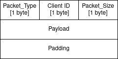
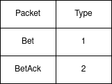
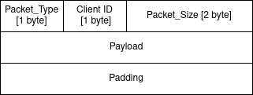
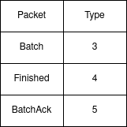
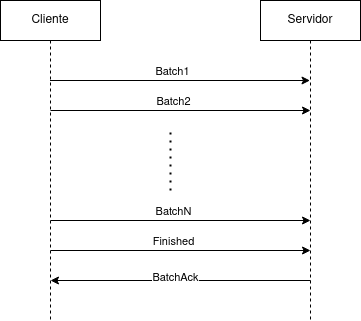
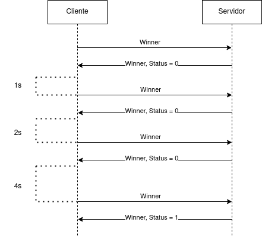

# Informe 


## Índice
1. [Parte 1: Ejercicios](#Ejercicios)
2. [Parte 2: Protocolo](#Protocolo)
3. [Parte 3: Sincronización](#Sincronización)

## 1. Ejercicios<a name="Ejercicios"></a>

La siguiente sección tiene como objetivo mostrar como ejecutar cada ejercicio. Si se revisan las branchs del repositorio se puede ver que
hay una branch que contiene hasta los ejercicios 1-4 y luego hay una branch por cada ejercicio siguiente. Esto es porque hay código
que fue siendo removido de la solución avanzando de ejercicio en ejercicio (por ejemplo el servicio script de la plantilla que genera
el docker-compose). Por lo tanto, para la correcta ejecución de cada ejercicio será necesario pararse en la branch correspondiente
(además aquí esta la última versión de la resolución de cada ejercicio). El historial de commits se encuentra también nombrado y dividido
según ejercicio

### 1.1 Docker

Para los ejercicios 1-4 dirigirse a la branch docker con el siguiente comando:
```
git checkout docker
```

#### Ejercicios 1-2
Para correr el script que genera el docker-compose con la cantidad de clientes deseada basta correr los comandos (Es necesario
tener python instalado en la máquina host):
```
pip install Jinja2
```
```
python docker-config.py <nro_clientes>
```

#### Ejercicio 3
Para que se corra el script correspondiente al ejercicio 3, dado que esta agregado como un servicio nuevo al docker-compose, basta
con correr el siguiente comando:
```
make docker-compose-up
```
Y para ver los logs de un servicio en particular:
```
docker logs <nombre_servicio> 
```
Para ver los logs del script:
```
docker logs script 
```
Para ver todos los logs;
```
make docker-compose-logs
```


#### Ejercicio 4
Para ejecutar este ejercicio simplemente correr el comando:
```
make docker-compose-up
```
Y luego para que se ejecuten los handlers de SIGTERM hay varias opciones, si se quiere enviar a todos los servicio (solo tiene efecto si los clientes
no finalizaron aún)
```
make docker-compose-down
```
Si se quiere enviar a uno en especifico
```
docker stop <nombre_servicio> -t <tiempo>
```
Y para ver los logs se utilizan los mismos comandos explicados en el Ejercicio 3

### 1.1 Ejercicios 5-8

Para ejecutar cada uno de estos ejercicios dirigirse a su branch correspondiente:
```
git checkout ej<nro_ejercicio>
```
Y luego los comandos para ejecución, finalización y logs son los mismos explicados anteriormente

El flujo normal para cada ejercicio es el siguiente:

Ejecución:
```
make docker-compose-up
```
Logs (se recomienda la segunda opción para ver cada servicio por separado):
```
make docker-compose-logs
```
```
docker logs <nombre_servicio> 
```
Finalización:
```
make docker-compose-down
```
```
docker stop <nombre_servicio> -t <tiempo>
```


## 2. Protocolo<a name="Protocolo"></a>

En la siguiente sección se describe el protocolo implementado. Se realizará una distinción entre lo implementado para el ejercicio 5 y lo implementado 
desde el ejercicio 6 en adelante

### 2.1 Ejercicio 5

Para el envio de una apuesta por parte del cliente y el correspondiete acknowledgment por parte del servidor se definió el siguiente protocolo. En primer lugar, 
se estableció un encabezado común a todos los paquetes del protocolo. La estructura de un paquete es la siguiente: 



Donde packet_type define el tipo de paquete enviado. Se tienen los siguientes tipos de paquete para este punto



Luego, el id identifica al cliente enviado al mensaje y el packet_size indica la longitud en bytes total del paquete

En el caso de un paquete Bet a continuación del encabezado se envian los datos de la apuesta, con los campos de la misma separados por el carácter "|".
Si se trata de un BetAck se envia simplemente un código de status en el payload y los campos necesarios también separados por un "|". Siempre
que haya que dividir los campos del payload de un paquete en protocolo se usara "|"

Finalmente, se agrega un padding para hacer que los bloques sean de tamaño fijo. En este caso el tamaño elegido fue de 128 bytes


### 2.2 Ejercicio 6

A partir del ejercicio 6 se agrega 1 byte más para el largo del paquete (Ya que al enviar batchs no alcanzaba con uno solo) 
salvo en los paquetes Bet. El endianness de este campo es little endian. Los paquetes de Bet implementados en el ejercicio 5 se usan ahora 
como parte del payload del nuevo paquete Batch. La estructura de un paquete queda entonces:



Para separar los Bets dentro de un Batch se utiliza el packet_size indicado por cada Bet.
En el ejercicio 6 se introducen los paquetes Batch, BatchAck y Finished con los siguientes packet_type:



El flujo de paquetes en condiciones normales es el siguiente:



Al igual que BetAck, BatchAck en el payload envia un código de status.

Finalmente,a partir de este ejercicio el tamaño fijo de los bloques se redefine a 8192 bytes

### 2.3 Ejercicio 7
En el ejercicio 7 se introduce el paquete Winner (ID: 6) para que el cliente consulte por los ganadores de la lotería en su agencia y el servidor pueda informarlos.
El encabezado es igual a lo definido anteriormente. En el payload de este paquete se indica un byte de status, para que el servidor informe al cliente
si el paquete Winner que envia contiene la información o no de los ganadores. Esto se debe a que el cliente va a enviar el paquete Winner y el sorteo puede
no haber sido realizado aún. Si al cliente le llega un paquete Winner con status 0 realiza un sleep hasta volver a realizar la consulta. El tiempo
de sleep va aumentando exponencialmente cada vez que se recibe una respuesta del servidor con status 0. El flujo de consulta es el siguiente:





## 3. Sincronización<a name="Sincronización"></a>
Para poder recibir y procesar mensajes en paralelo como se requiere en el Ejercicio 8, se utilizó la libreria de python multiprocessing.
Cada vez que llegue una conexión al servidor se spawnea un proceso y se le envian los argumentos necesarios para sincronizar sus
accesos a disco para guardar/cargar apuestas o acceder a memoria que comparten los procesos. Los procesos no terminan hasta no terminar 
de manejar adecuadamente el flujo de mensajes con su cliente correspondiente.

Para el caso de hacer process safe el uso de las funciones **store_bets()** y **load_bets()** simplemente se opto por un lock
llamado *utils_function_lock*, el cual los procesos adquieren previo a utilizarlas y liberan luego de finalizar su uso.

Por otro lado, para que cada proceso pueda registrar que su cliente termino de enviar apuestas y todos puedan consultar esto
(y eventualmente responder al mensaje Winner de un cliente con los ganadores o decirle que espere) se utiliza un tipo provisto
por la libreria multiprocessing como lo es Array, para el cual tambien se define un lock para acceso exclusivo *clients_ready_lock*

Finalmente, hay también un uso del tipo Value provisto por multiprocessing (de nuevo junto a un lock para su acceso) el cual se
utiliza para el graceful shutwdown en caso de recibir el proceso principal la señal SIGTERM


